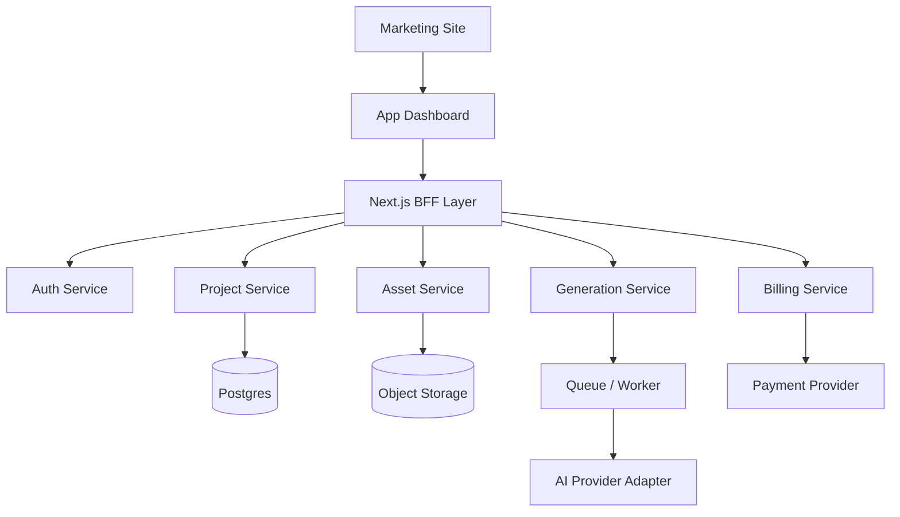
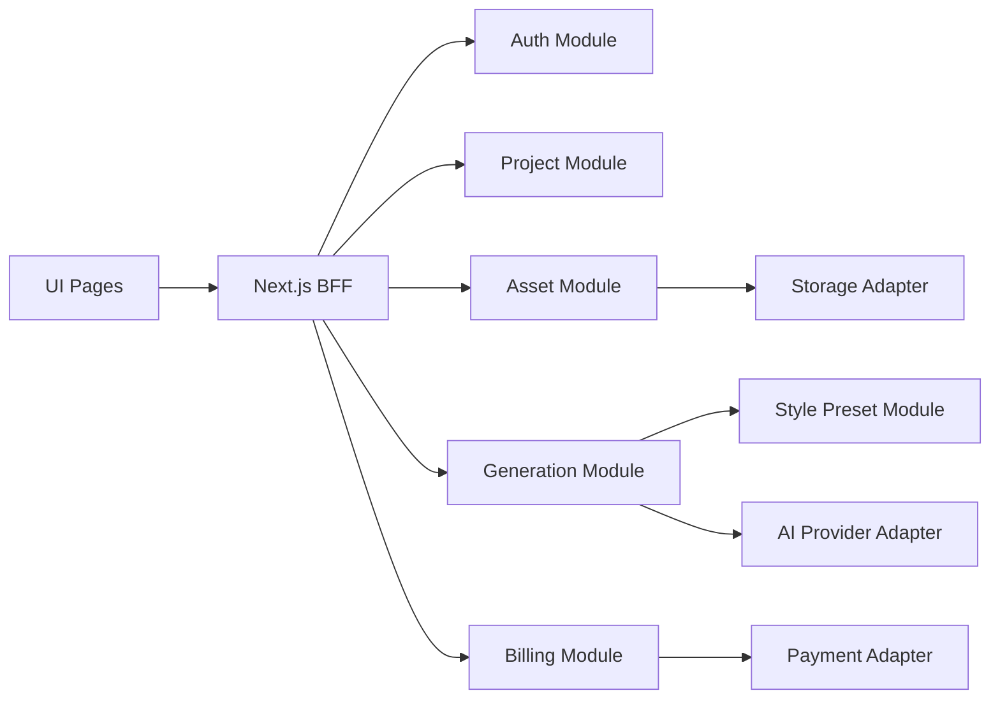
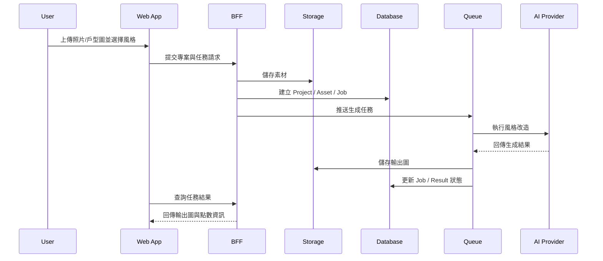
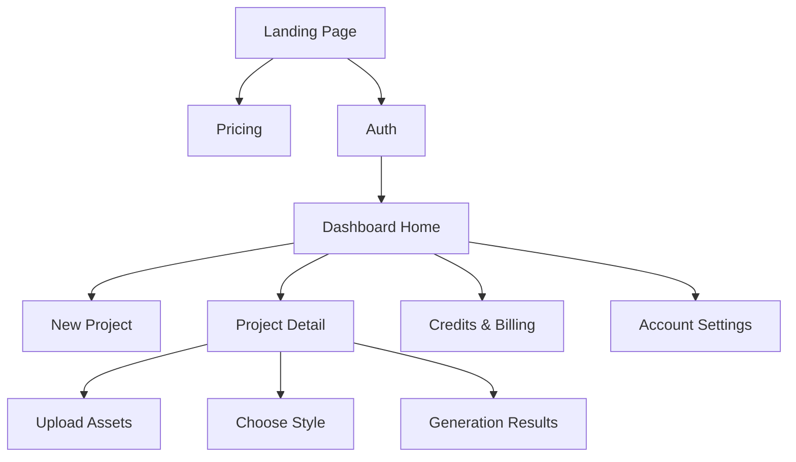

# AI 室內改造 SaaS 架構設計文件

## 1. 設計目標

本架構以「快速上線、低耦合、可替換外部服務」為核心，支援以下主流程：

1. 使用者登入
2. 建立空間專案
3. 上傳照片或戶型圖
4. 選擇風格模板
5. 提交 AI 生成任務
6. 查看結果並消耗點數

## 2. 建議系統分層

## 3. 模組說明

### 3.1 Web 層

- Marketing Site
  - 說明產品價值、案例、方案與 CTA
- App Dashboard
  - 使用者專案管理、結果瀏覽、點數與設定

### 3.2 BFF / Server Layer

使用 `Next.js Route Handlers` 或 server actions 作為薄型 BFF 層，責任如下：

- 驗證使用者身份
- 寫入專案資料
- 驗證上傳素材
- 建立生成任務
- 查詢任務狀態與結果
- 封裝第三方服務回應

### 3.3 Domain Services

1. Auth Service
   - 註冊、登入、方案權限、使用額度
2. Project Service
   - 專案建立、空間類型、偏好欄位
3. Asset Service
   - 照片、戶型圖、縮圖、原始檔管理
4. Generation Service
   - 任務建立、prompt 組裝、狀態追蹤、重試策略
5. Billing Service
   - 點數扣除、充值、支付同步、方案權限

## 4. 模組依賴圖

設計約束：

- UI 不直接耦合第三方 AI 或支付 SDK。
- `Generation Module` 只透過 `AI Provider Adapter` 呼叫外部模型。
- `Billing Module` 只透過 `Payment Adapter` 呼叫支付供應商。

## 5. 資料流向圖

## 6. 核心介面契約

### 6.1 Project Contract

- Input
  - `name`
  - `spaceType`
  - `stylePresetId`
  - `preferenceTags[]`
- Output
  - `projectId`
  - `createdAt`
  - `status`

### 6.2 Asset Contract

- Input
  - `projectId`
  - `assetType` = `photo | floorplan`
  - `fileUrl`
  - `mimeType`
- Output
  - `assetId`
  - `previewUrl`
  - `validationStatus`

### 6.3 Generation Job Contract

- Input
  - `projectId`
  - `stylePresetId`
  - `assetIds[]`
  - `qualityLevel`
- Output
  - `jobId`
  - `jobStatus`
  - `creditCost`
  - `estimatedWaitTime`

## 7. 建議資料模型

### 7.1 Users

- `id`
- `email`
- `planType`
- `creditBalance`
- `createdAt`

### 7.2 Projects

- `id`
- `userId`
- `name`
- `spaceType`
- `status`
- `createdAt`

### 7.3 Assets

- `id`
- `projectId`
- `assetType`
- `filePath`
- `metadata`

### 7.4 GenerationJobs

- `id`
- `projectId`
- `stylePresetId`
- `status`
- `provider`
- `creditCost`
- `errorMessage`

### 7.5 GenerationResults

- `id`
- `jobId`
- `imageUrl`
- `thumbnailUrl`
- `versionLabel`

### 7.6 CreditLedger

- `id`
- `userId`
- `delta`
- `reason`
- `referenceType`
- `referenceId`

## 8. 頁面資訊架構

## 9. 安全與隱私要求

1. API 金鑰、支付密鑰、儲存金鑰只從 `.env` 讀取。
2. 上傳檔案需驗證格式、大小與副檔名。
3. 生成結果需綁定使用者專案權限，不可任意公開列舉。
4. 需預留素材刪除與帳號資料刪除能力，以支援隱私要求。

## 10. 可替換點設計

為避免綁死單一供應商，需明確抽象以下 adapter：

1. `AiProviderAdapter`
2. `StorageAdapter`
3. `PaymentAdapter`
4. `ImportAdapter`（未來支援 RoomPlan / 掃描資料時使用）

## 11. 不建議事項

1. 不要在第一版直接做可編輯 3D WebGL 編輯器。
2. 不要把 prompt 組裝邏輯散落在 UI 元件。
3. 不要把點數判斷直接寫在頁面按鈕事件中。
4. 不要先做過多企業功能，先驗證個人用戶的核心價值。
