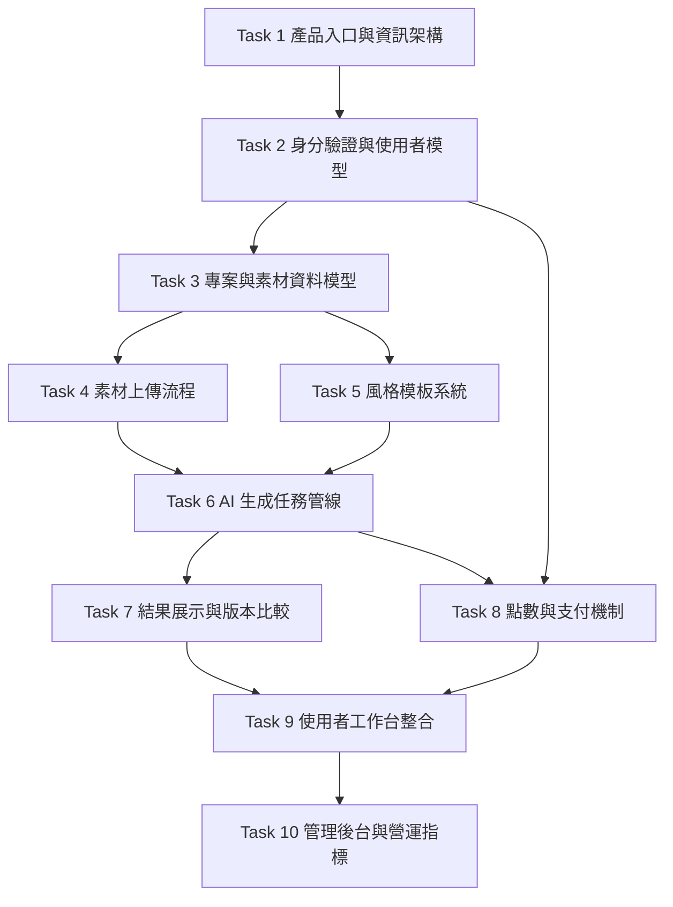

# AI 室內改造 SaaS 原子任務拆解

## 1. 原子任務設計原則

每個任務必須滿足：

1. 有清楚輸入契約
2. 有可驗證輸出
3. 可獨立測試
4. 不混合多個責任
5. 能在失敗時局部回滾或替換

## 2. 任務依賴圖

## 3. 任務清單

### Task 1：產品入口與資訊架構

- 目標
  - 規劃 Marketing Site、Pricing、Auth、Dashboard 的頁面結構
- 輸入契約
  - `CONSENSUS_ai-interior-saas.md`
  - `DESIGN_ai-interior-saas.md`
- 輸出契約
  - 頁面 sitemap
  - 導航結構
  - MVP 文案區塊清單
- 實作約束
  - 保持與現有 `Fit Renov` 引流內容低耦合
  - 新產品線入口可獨立部署或獨立路由

### Task 2：身分驗證與使用者模型

- 目標
  - 建立註冊、登入、會話管理與方案欄位
- 輸入契約
  - Auth provider 選型結果
- 輸出契約
  - `User` model
  - auth middleware / guard
  - 受保護頁面機制
- 實作約束
  - 禁止把 provider SDK 直接散落在頁面元件
  - 權限與方案欄位需可擴充

### Task 3：專案與素材資料模型

- 目標
  - 定義 `Project`、`Asset`、`StylePreset`、`GenerationJob`、`GenerationResult`
- 輸入契約
  - `DESIGN_ai-interior-saas.md` 的資料模型章節
- 輸出契約
  - schema / type definitions
  - repository interface
- 實作約束
  - 型別命名清晰，不得使用模糊欄位名稱
  - 狀態欄位需枚舉化

### Task 4：素材上傳流程

- 目標
  - 支援照片與戶型圖上傳、預覽、驗證與刪除
- 輸入契約
  - `projectId`
  - 檔案格式規範
- 輸出契約
  - asset upload API / action
  - 上傳 UI
  - 驗證與錯誤訊息
- 實作約束
  - 檔案大小與 mime type 必須驗證
  - 原始檔與縮圖分離管理

### Task 5：風格模板系統

- 目標
  - 建立可管理的風格模板與 prompt 組裝規則
- 輸入契約
  - 風格分類清單
  - 房間類型清單
- 輸出契約
  - `StylePreset` model
  - prompt builder interface
  - 前台選擇器
- 實作約束
  - prompt 模板集中管理
  - UI 不直接持有模型供應商細節

### Task 6：AI 生成任務管線

- 目標
  - 建立生成任務、背景處理、結果儲存與重試流程
- 輸入契約
  - `projectId`
  - `assetIds[]`
  - `stylePresetId`
- 輸出契約
  - generation job API
  - queue worker
  - provider adapter
  - job status polling / refresh
- 實作約束
  - 任務狀態必須可追蹤
  - 失敗需保留錯誤原因
  - 不可在同步請求中阻塞等待整個生成完成

### Task 7：結果展示與版本比較

- 目標
  - 顯示生成圖片、版本標籤、前後比較與再次生成入口
- 輸入契約
  - `GenerationResult[]`
- 輸出契約
  - result gallery UI
  - comparison UI
  - download/share hooks
- 實作約束
  - 先做圖片比較，不做複雜 3D 比較器
  - 手機版需要可用

### Task 8：點數與支付機制

- 目標
  - 支援免費額度、扣點、充值、付款同步
- 輸入契約
  - plan rules
  - credit cost rules
- 輸出契約
  - `CreditLedger`
  - balance query
  - checkout flow
  - webhook sync
- 實作約束
  - 扣點邏輯需具一致性
  - 支付狀態與點數入帳需可追蹤

### Task 9：使用者工作台整合

- 目標
  - 將專案、結果、點數、近期操作整合為完整 Dashboard
- 輸入契約
  - Task 2, 4, 6, 7, 8 的已完成輸出
- 輸出契約
  - dashboard page set
  - loading / empty / error states
- 實作約束
  - Dashboard 為整合層，不承擔底層商業邏輯

### Task 10：管理後台與營運指標

- 目標
  - 提供最小可用營運後台，查看生成量、失敗率、點數消耗
- 輸入契約
  - 事件追蹤與資料查詢能力
- 輸出契約
  - admin summary page
  - metrics widgets
  - job inspection list
- 實作約束
  - 只做最小維運能力，不做完整 CRM

## 4. 建議執行順序

1. P0：Task 1, 2, 3
2. P1：Task 4, 5, 6
3. P2：Task 7, 8
4. P3：Task 9, 10

## 5. TDD 驗收建議

每個任務進入實作前，先補以下測試：

1. Domain / utility 測試
   - 狀態轉移
   - 點數計算
   - prompt builder
2. API / action 測試
   - 輸入驗證
   - 權限驗證
   - 錯誤回應
3. UI 狀態測試
   - loading
   - empty
   - error
   - success

## 6. 實作檢查清單

- 完整性：輸入、狀態、輸出是否完整
- 一致性：命名、型別、狀態列舉是否一致
- 可行性：是否依賴尚未存在的底層能力
- 可控性：是否可追蹤錯誤與任務狀態
- 可測性：是否能對 domain 與流程做 focused test

## 7. 建議的第一個開發切片

若之後要正式開發，建議第一刀只做以下垂直切片：

1. 使用者登入
2. 建立專案
3. 上傳 1 張室內照片
4. 選擇 1 個風格模板
5. 建立 1 次生成任務
6. 回看 1 張結果圖

這條切片最能驗證產品核心價值，也最容易暴露資料模型與任務管線問題。
